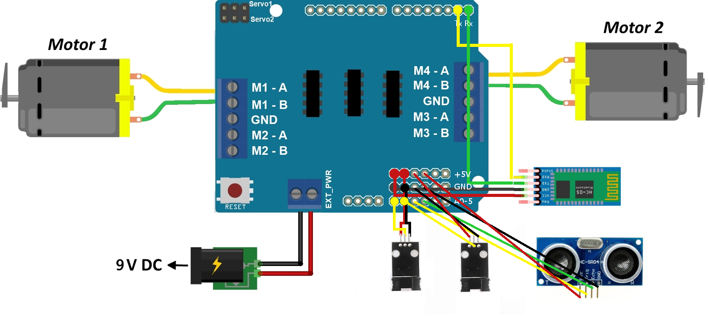

# TiffinBoxRobot

A Simple Arduino based robot.
General planning and guidelines go here.

## Pre-requisites
Installation of [Adafruit Motor Shield Library](https://learn.adafruit.com/adafruit-motor-shield/library-install) is required.

## Progress
### Hardware
- [x] Chassis
- [x] Assembling
- [x] Final Run

### Software
- [x] Bluetooth Control
- [x] Follow Wall
- [x] Avoid Obstacle
- [ ] Follow Line

## Circuit Diagram

> Got lazy. Did ending part in MS Paint.

## Pin usage in Adafruit Motor Shield

1. Reserved Pins:
   - Pin 4
   - Pin 7
   - Pin 8
   - Pin 9
   
2. Motor driving pins:
   - Slot M1: Pin 11
   - Slot M2: Pin 3
   - Slot M3: Pin 5
   - Slot M4: Pin 6
   - Slot for Servo1: Pin 9
   - Slot for Servo2: Pin 10
   
3. Free/Unused Pins:
   - Pin 0 (Rx)
   - Pin 1 (Tx)
   - 6 Analog Pins (A0 - A5) (Can be used as Digital Pins)
   - Pin 2
   - Pin 13
   
4. Extra Pins provided:
   - 6 Vcc (+5v) Pins
   - 6 GND Pins
   
## Pins needed per Modules/Sensors

1. Bluetooth Module
   - Pin 0 (Rx)
   - Pin 1 (Tx)
   - Vcc (+5v)
   - GND

2. Speed Sensor
   - Vcc (+5v)
   - GND
   - 2 Digital Pins
   per Sensor
   
3. Ultrasonic Sensor
   - Vcc (+5v)
   - GND
   - 2 Digital Pins (for Trig and Echo)
   
## Assigning Pins

1. Motor 1
   - Slot M1
   
2. Motor 2
   - Slot M4
   
3. Bluetooth Module
   - Pin 0 (Tx)
   - Pin 1 (Rx)
   - Vcc (+5v) (1st of 6 pins)
   - GND (1st of 6 pins)
   
4. Speed Sensor (Sensor1, Sensor2)
   - A0, A1
   - Vcc (+5v) (2nd, 3rd of 6 pins)
   - GND (2nd, 3rd of 6 pins)
   
5. Ultrasonic Module
   - A2 (Trigger)
   - A3 (Echo)
   - Vcc (+5v) (4th of 6 pins)
   - GND (4th of 6 pins)
   
## Controlling the Bot

The recommended Android App is [Bluetooth Electronics](https://play.google.com/store/apps/details?id=com.keuwl.arduinobluetooth&hl=en) available free on the Play Store.

The following properties of the controller has to be set up for proper functioning:
1. Forward Button:
   - Press: "f"
   - Release: "F"
   
2. Backward Button:
   - Press: "b"
   - Release: "B"
   
3. Left Button:
   - Press: "l"
   - Release: "L"
   
4. Right Button:
   - Press: "r"
   - Release: "R"
   
5. Object Detection Trigger Button:
   - Press: "o"
   - Release: ""
   
6. Wall Follower Trigger Button:
   - Press: "w"
   - Release: ""
   
7. Speed Control Slider:
   - Min: 0
   - Max: 255
   - On Change: "" + value + "A"
   
Pictures of each component has been provided in image form in the /Images folder.
